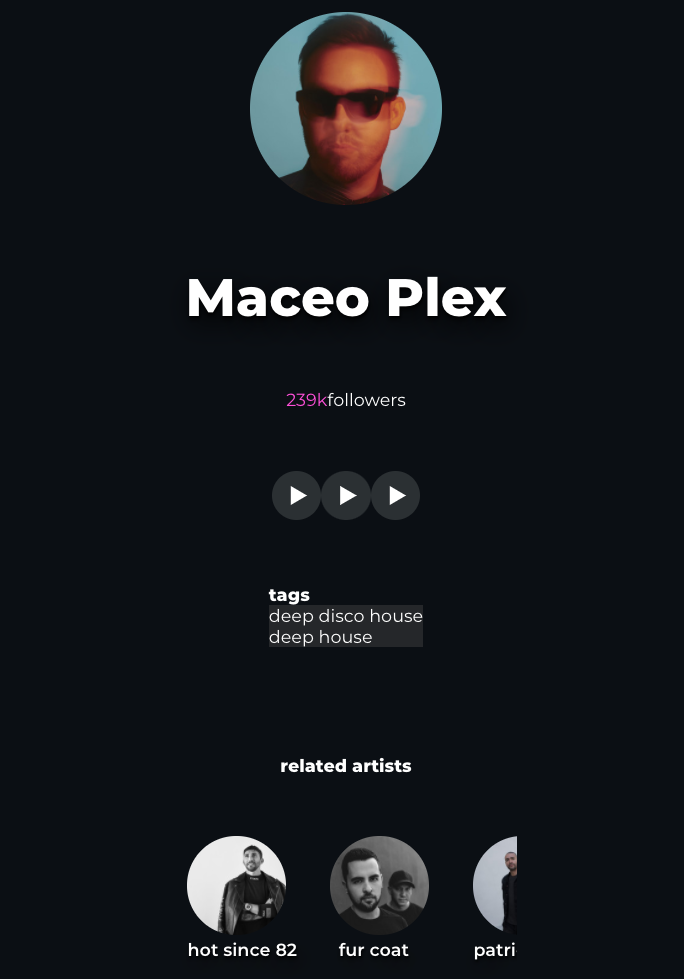

# Redux  - Spotify client

### Project Title

Shopify - Track Demo

### Getting Started
These instructions will get you a copy of the project up and running on your local machine for development and testing purposes.
Go to the server directory. Run npm install/yarn install followed by npm start/yarn start. The server will be running on port 5678
Go to the workshop directory. Run npm install/yarn install followed by npm start/yarn start. Accept to listen to FE on port 3000
### Flow for user.

## Main User:
- Play songs, and see all artists related to the select artist. 

- Once clicked a related artist. It will render his page.
## Related User:

### Prerequisites
-node.js, npm/yarn
### Built With
Node.js - Backend
React - FrontEnd
### Authors
Scott Morin.
Josh Commeau.
Peter Sacrdera.
### License
This project is licensed under the MIT License - see the LICENSE.md file for details
### Acknowledgments
Big thank you to Josh Commeau & Scott for the backend setup.

