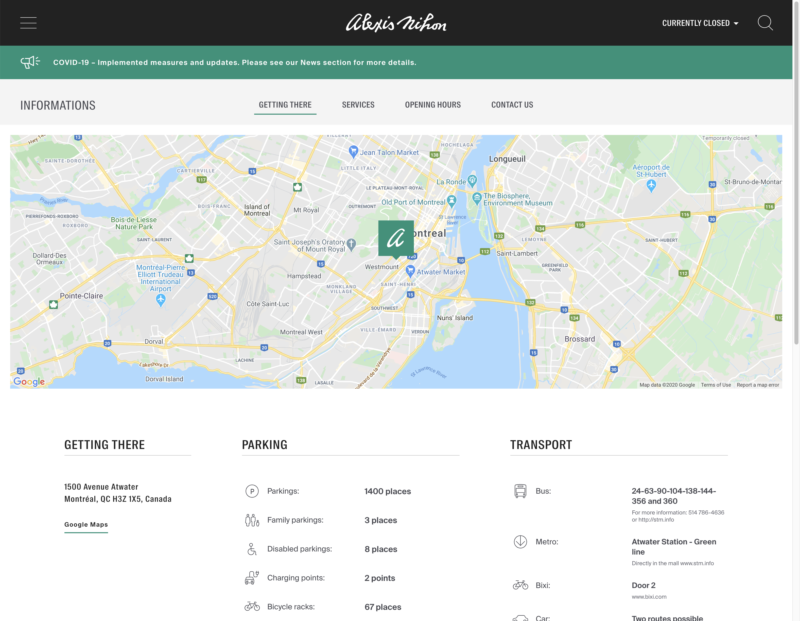

# 5.2.2 Accessing Third Party APIs

---

## What is an API?

- Stands for "Application Programming Interface"
- Lets you interact with some third party.

---

## Example: Google Maps



---

- APIs vary widely by company
- Often, they have a free tier which caps usage
- They require authentication

---

## API Keys

When you sign up to use an API, they give you an "API key".

Looks like this:

`baa43016-30c8-498a-b3e0-00a1b2a2cb90`

This is a secret!

---

## Example: AviationStack API

- Gives you realtime information about _flights_
- Free plan includes 500 requests a month
- Could be useful if you were building a "flight status" application!

---

## Security

Let's say you have some React code like this:

```js
const App = () => {
  const [data, setData] = React.useState(null);

  React.useEffect(() => {
    fetch('https://tdbank.com/balance?secretKey=abcd1234').then(setData);
  }, []);

  return `Your bank balance is ${data.balance}`;
};
```

Is there something wrong here?

---

## Question

How do you use a secret value in your front-end code?

---

## Server as a middleman

Here's how we typically get around this problem:

- Your _server_ has the API secret
- The client sends a request, saying it wants to access an API
- The server asks the 3rd-party API for an _access token_
- The server gives the client the token
- The client uses that token.

---

This is complicated, so let's sketch it out.

---

## Working with APIs

APIs will have rich documentation.

Let's look at the [Spotify docs](https://developer.spotify.com/documentation/web-api/reference/artists/get-artist/)

---

It can be hard to learn to read API documentation.

It opens so many doors though.

---
